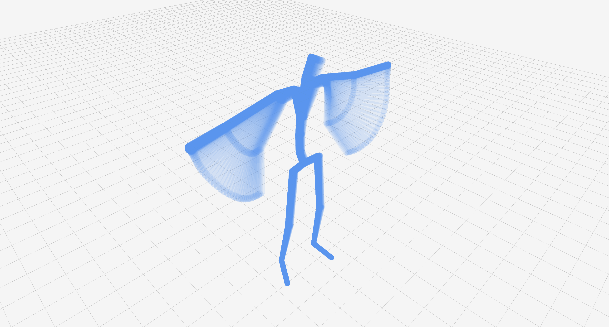

# 👀 BVH visualizer<!-- {docsify-ignore} -->
##  Raylib visualizer
To visualize a bvh or many bvh files, a BVH visualizer is implemented using [raylib](https://www.raylib.com/). This visualizer is implemented in the **bvhVisualizer** class. It contains advanced controls, many camera modes, and specific rendering options, like skeleton color, size or showing labels. Instead of controlling the animation with parameters, the visualizer itself has a GUI to control the visual aspect of every skeleton separately.

[bvhVisualizer](../../media/visualizer.mp4 ':include :type=video controls width=100% height=400px')

##### `showBvhAnimation(bvhData: BVHData | list[BVHData]) -> None`
```python
from bvhTools.bvhVisualizer import showBvhAnimation
# showing one animation file
showBvhAnimation(bvhData)
# showing various animation files
showBvhAnimation([bvhData0, bvhData1, bvhData2])
```

### 🧅 Onion skin visualization
Onion skin visualization is a useful way of representing an animation in a single image. The viewer implements a function to create this kind of visualizations, and provides a way to render screen captures of them, just by pressing the "c" button, for scientific purposes among others.


##### `showOnionSkinAnimation(bvhData: BVHData | list[BVHData]) -> None`
```python
from bvhTools.bvhVisualizer import showOnionSkinAnimation
# showing one animation file
showBvhAnimation(bvhData)
# showing various animation files (NOT RECOMMENDED IF THEY ARE NOT VERY SHORT)
showBvhAnimation([bvhData0, bvhData1, bvhData2])
```

**Important note:** The onion skin visualization has to render a lot of capsules every frame, depending on the length of the provided animation and the structure of the BVH tree. For this reason, I suggest not to visualize very long animations. If you NEED to visualize a long animation (this depends on the hardware, but I have made a stress test with my laptop and FPS started to decay at 200 frames) one option is to [resample](../motionEditor/index.md#️-resampling-the-fps-of-an-animation) the original animation to represent a longer time with less frames.
```python
from bvhTools.bvhVisualizer import showOnionSkinAnimation
from bvhTools.motionEditor import resampleFPS
# original animation: 30 fps, 2000 frames
bvh = resampleFPS(bvh, 3) # resampled animation: 30 fps, 200 frames
showBvhAnimation(bvh)
```


##  Matplotlib visualizer (Deprecated)
⚠️ *Note: This visualizer is deprecated, I suggest to use the [raylib visualizer](#raylib-visualizer) for simpicity, better performance, and overall experience. Above everything, the raylib visualizer is capable to show many animations at the same time, with no FPS drawback.*

A BVH visualizer is implemented using matplotlib for quick viewing on the **bvhVisualizerMpl** class. It contains a basic play/pause button and forward/back buttons to pass frames one by one. It also permits to jump to specific frames and to change the speed of time for faster/slower playback.

[bvhVisualizerMpl](../../media/mplVisualizer.mp4 ':include :type=video controls width=100% height=400px')

The visualization can be **customized** using many options, even if not giving any parameters will show an animation with the default options. The complete function looks like this:

##### `showBvhAnimation(bvhData: BVHData, showPoints: bool = True, showLines: bool = True, showQuivers: bool = True, showLabels: bool = False, showFootContacts:bool = False, footContactMethod: str = "distance", footNames: str = ["LeftFoot", "RightFoot"], speedThreshold: float = 0.1, timeDiff: float = -1.0, heightThreshold: float = 0.1, referenceFrame: int = 0, showSpeeds: bool = False, normalizeSpeeds: bool = False, speedVectorSize: float = 1.0, pointColor: str = "#4287f5", pointMarker: str = "o", lineColor: str = "#666666", lineWidth: float = 2.0):`

This is a very extensive method with many options. However, most of them are deactivated by default. In the following sections, the customization process is explained in different steps, with examples.

### Basic visualization
For basic visualization of animations, the `showBvhAnimation()` function can be used in its simplest form:

```python
from bvhTools.bvhVisualizerMpl import showBvhAnimation

showBvhAnimation(bvhData)
```

This basic visualization shows the skeleton joints as blue points, joined by grey lines. It also shows some quivers to represent the axes.

The basic visualization can be expanded by changing the following parameters:

- `showPoints`: bool = False: It will hide the points and won't draw them.
- `showLines`: bool = False: It will hide the lines and won't draw them.
- `showQuivers`: bool = False: It will hide the quivers and won't draw them.
- `showLabels`: bool = True: It will show the names of the joints with labels.
- `pointColor`: str = "#XXXXXX": It will change the color of the points given a hexadecimal string.
- `pointMarker`: str = "": It will change the shape of the points given a character. [List of accepted characters](https://matplotlib.org/stable/api/markers_api.html)
- `lineColor`: str = "#XXXXXX": It will change the color of the lines given a hexadecimal string.
- `lineWidth`: int = 2.0: It will change the width of the lines.

### Foot contact visualization
A more advanced visualization that shows the foot contacts is also available, even if it is turned off by default. This visualization will show a green circle if a foot is touching the ground and a red one if it is not. This visualization mode is good to visually assess the best parameters and foot contact calculation methods for a specific animation.

To use the foot contact visualization, the **showFootContacts** flag has to be set to true. Then, the visualization can be expanded by changing the following parameters:

- `footContactMethod`: Available options ["height", "speed", "both"]. This option enables to choose the foot contact calculation method. The methods are explained in more detail in the **bvhMetrics** class documentation. If the "both" option is chosen, the foot contact mask will be calculated by performing a logical and between the "speed" and the "height" masks.
- `footNames`: A list of strings to define the names of the feet of the specific BVH animation. It can be a list of an arbitrary length, from 1 to n. This enables to perform foot contact on quadrupeds, for instance.
- `speedThreshold`: **Only if footContactMethod uses speed**. The speed threshold used to calculate the mask. If a foot has higher speed than threshold, it will be marked as not touching the ground in that frame.
- `timeDiff`: **Only if footContactMethod uses speed**. This can be used to specify a different time delta to calculate the speed. By default, the method uses the Frame time information from the BVH file.
- `heightThreshold`: **Only if footContactMethod uses height**. The height threshold used to calculate the mask. If a foot has a bigger distance from the ground than the threshold, it will be marked as not touching the ground in that frame. 
- `referenceFrame`: **Only if footContactMethod uses height**. The frame number used to calculate the ground level height. The method uses a specific frame to calculate where the ground is. Ideally, this should be a frame in which the character is standing straight on the ground.

### Speed visualization
If the `showSpeeds` argument is set to True, the plot will show the corresponding 3D speed vector in each joint. Usually, the visualization would return very big vectors, since the magnitude of the vectors in typical animations is much greater if we compare to absolute position values. 

To control the size of the visualized speeds, you can first set the `normalizeSpeeds` argument to True, so that the vectors will be normalized by dividing them with the median speed value. *Note: the median is used instead of the mean, since some animation may have outliers that negatively affect the calculation*.

Then, use the `speedVectorSize` argument to have an exact control about the size of the vectors. This argument is applied as a multiplier to the final speeds.